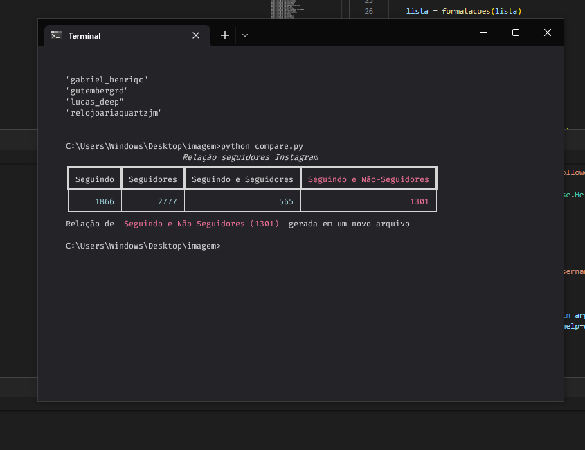

<p align="center"></p>
<p align="center">instacheckfollowers project: followers list, Following list and Non-Followers that you following list</p>
<h1 align="center">
 
  

</br>
</h1>
</br>

## 🛠 Technologies used

</br>


## 🚀 How to start

To contribute to this project or learn from it is very simple, just clone this repository on your computer and install the necessary dependencies for it to work. Below you can check how to do this, as well as how to run it.

### 📌 Requirement

> Python and pip

### ✨ Now are you ready to start 

> clone the repository
```bash
git clone https://github.com/LuciLua/instacheckfollowers.git
```

> open project folder
 ```bash
cd ./instacheckfollowers
```

> install all dependencies using pip
```bash
pip install -r requirements.txt
```

## 🏇 How to use

> Firts you must have run exec.py with the params necessarys, after this you can run compare.py for generate the list of non-followers that you following

#### 1. params of "exec.py"
 ```bash
python exec.py --username *<your_username>* --whois *<acount_query>*
``` 
#### 2. In "compare.py"
 
Just run (not changes the place of files created when you run "exec.py")
 ```bash
 python compare.py
 ``` 
## ✅ Result

At last, three files are generated: (1) followers, (2) following, and (3) non-followers_that_you_following 

The table generated in the terminal also shows a a relationship between your followers and followers

## 🖼 Preview

**So far, this is the preview, but you can check it out at [this updated link](https://pokedex-of-luci.vercel.app/)**


